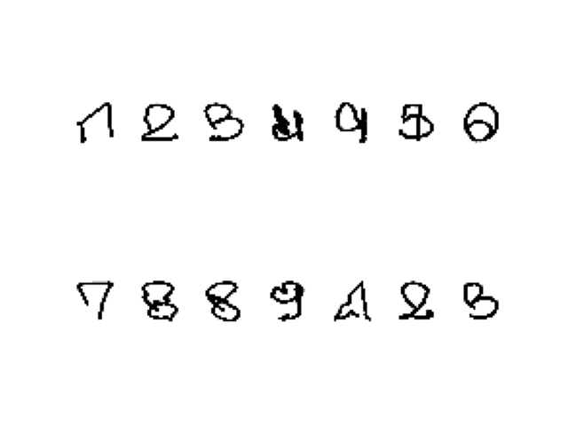
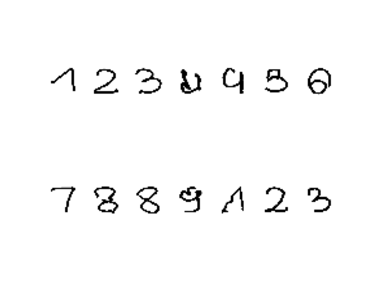
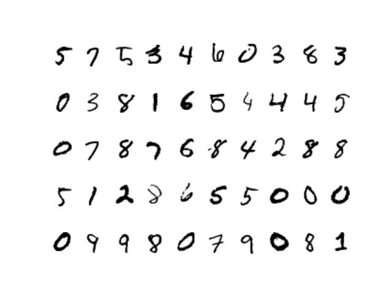
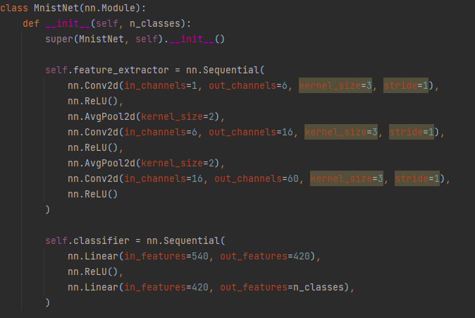
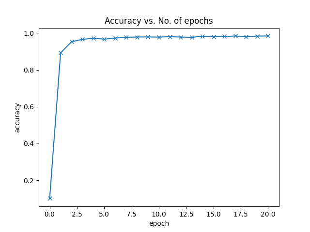
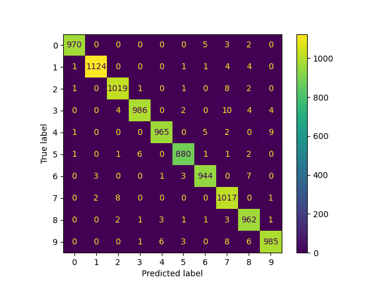
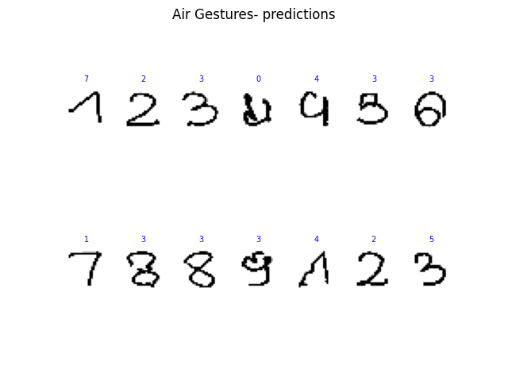

#  Air handwritten gesture recognition tutorial [work in progress...]
Hand gesture recognition for human computer interaction has numerous applications;
from TV remote control, gaming, Virtual and or augmented reality, in car hand gesture control, etc. 
A successful hand gesture recognition system  requires: 
1. A robust hand detector,
2. A means of gesture spotting to know when a gesture start and ends
3. A gesture recognition method

## Hand trajectory
We will be using mediapipe  https://google.github.io/mediapipe/solutions/hands.html 
to detect and track the hand on a webcam. Mediapipe hand  detector provides us with information of 21 hand landmarks. 
 To mark a start of a gesture one opens his hand palm and closes it to mark an end of a gesture one can close the hand 
Bellow are samples of air handwritten gestures(hand trajectories) 

 Although the above gestures are spotted, they still have  noises mostly at their beginnings and ends.
  Dropping a few points[one can try a number that works for one's gesturing style ] at the beginning and end, generates neater gestures, as showen in bellow picture 

 Now that we have digits, we can try to recognize them. 
## Air handwritten digit recognition: Transfer learning

As it is time consuming to record enough samples from various people to capture gesture variations, 
lets first consider transfer learning and utilized a model trained on MNIST digit dataset. 

Use a model trained on MNIST digit dataset to recognize handwritten digits in the air
in front of a webcam. Analyze the results and come up with a more appropriate 
recognition method if necessary.
  Air handwritten digits differ from paper handwritten digits due to a number of factors
  +  No support, you are writing in the air, producing many gesturing variations even for the same person
  +  noisy hand gesture trajectory due to clutter environment 
  + Gesture spotting: knowing the exact start and end points of a gesture 
 
  Now let us train a model capable of recognizing handwritten digits

- [x] Train the model mnist digit dataset 
       
  
- [x] Test the trained model on handwritten digits 
   
  here a confusion matrix is used as accuracy measure as it provides information on interclass confusion
  
- [x] Test the trained model on air handwritten digits 
  
  does not look good!
- [x] Online air handwritten testing  
  with a bit of patience, one can get his gesture correctly recognized
- [ ] Fine-tuning: Collect enough samples of air handwritten digits for fine-tuning the mnist model 
  1. need to collect samples
- [ ] Consider a different  method for online air handwritten digit  
